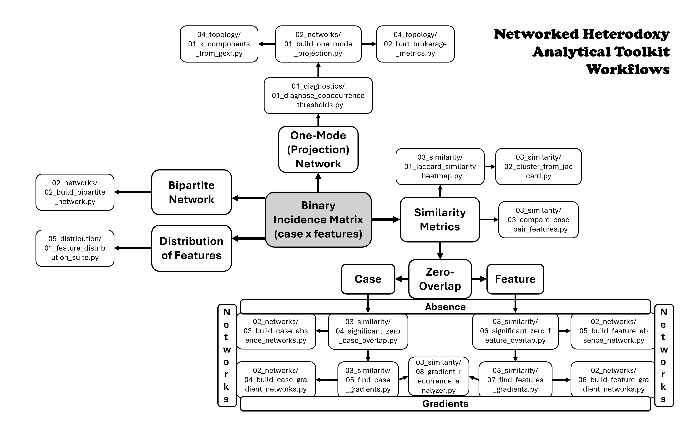
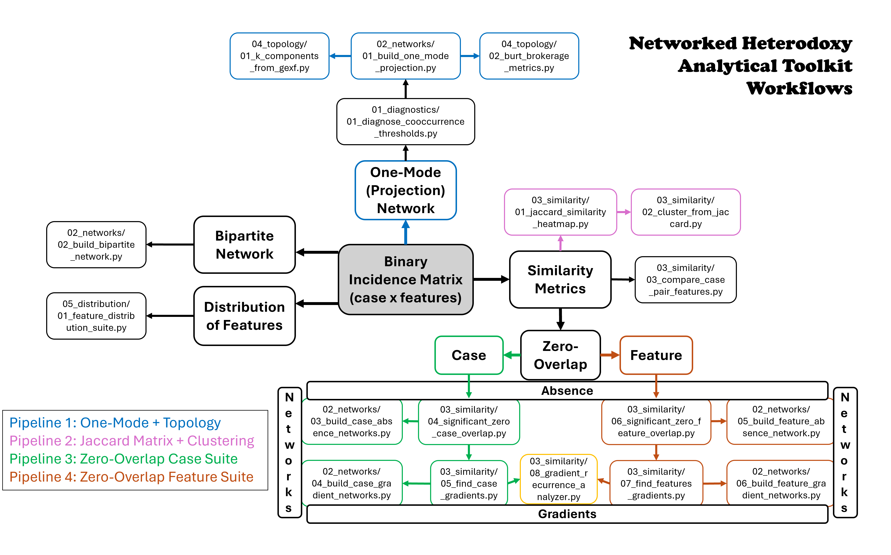

# Networked Heterodoxy Tools

This repository contains scripts, workflows, and documentation developed for computational analysis in the dissertation:

**_Networks of Heterodoxy: Shared Dissent and the Dynamics of Counter-Discourse_**  
Kevin Whitesides (2026), University of California, Santa Barbara

---

## Overview

This toolkit operationalizes the concept of **networked heterodoxy** by modeling cultural datasets as relational structures of:

- **Similarity** (shared feature repertoires)
- **Absence** (structural disjunction)
- **Gradients** (mediated pathways across discourse space)

The core data structure is a **binary case × feature incidence matrix**, where:

- rows = cases (books, songs, documents, etc.)
- columns = features (tropes, entities, concepts, topics)

The toolkit enables researchers to:

- identify clusters and discourse communities  
- detect structural disjunctions (zero-overlap regions)  
- trace mediated pathways across conceptual space  
- analyze network topology and brokerage structure  

Scripts are organized **by methodological task rather than dataset**, making them reusable across domains.

---

## Contents

- [Getting Started](#getting-started)
- [Repository Structure](#repository-structure)
- [Toolkit Workflows](#toolkit-workflows)
- [Pipelines](#pipelines)
- [Analytical Logic](#analytical-logic)
- [Glossary](#glossary)
- [Data Format Assumptions](#data-format-assumptions)
- [Dependencies](#dependencies)
- [External Tools](#external-tools)

---

## Getting Started

### Option 1: Clone with Git

```
git clone https://github.com/KevinWhitesides/networked-heterodoxy-tools.git
cd networked-heterodoxy-tools
```

### Option 2: Download ZIP

- Click **Code → Download ZIP** on GitHub  
- Extract the folder  
- Open a terminal in the extracted directory  

---

### Running a pipeline

From the repository root, run:

    python workflows/pipelines/02_jaccard_pipeline.py

This will:

- execute the full pipeline  
- create a timestamped output directory  
- generate stage outputs and a pipeline summary  

---

## Repository Structure

- `01_diagnostics/` — Threshold and structural diagnostics for calibrating network construction.
- `02_networks/` — Construction of one-mode and bipartite networks derived from binary incidence matrices and topic models.
- `03_similarity/` — Similarity, non-overlap, and gradient analyses for identifying clusters, boundaries, and mediated pathways within case × feature datasets.
- `04_topology/` — Structural network analysis, including k-component decomposition and brokerage metrics.
- `05_distribution/` — Distribution of features across producers within a discourse space, including prominence, diffusion, concentration, and clique identification.
- `06_topic_modeling/` — MALLET workflows, pyLDAvis, topic dendrograms.


- `docs/` — Methodological notes, data format specifications, and supporting documentation.
- `workflows/` — Descriptions of how scripts were applied in specific case studies (e.g., the 2012 literature corpus and the Five Percenter Hip Hop corpus).

---

## Toolkit Workflows

The diagram below illustrates the **overall analytical workflow structure** of the Networked Heterodoxy toolkit.

It shows how different analytical components relate to one another.  

[](workflows/networked_heterodoxy_workflows.png)

---

## Pipelines

This repository includes **four core pipelines**, each corresponding to a distinct analytical problem.

[](workflows/Pipelines/networked_heterodoxy_pipelines.png)

Pipeline implementations are located in:

`workflows/pipelines/`

These scripts:

- run multi-stage analyses automatically  
- organize outputs into structured directories  
- generate summary files documenting each run  

### Pipeline Summary

| Pipeline | Focus |
|----------|------|
| **Pipeline 1** | Network construction + topology |
| **Pipeline 2** | Similarity + clustering |
| **Pipeline 3** | Case-level absence + gradients |
| **Pipeline 4** | Feature-level absence + gradients |

For details, see:

- `workflows/README.md` — general workflow structure  
- `workflows/pipelines/README.md` — pipeline-specific documentation  

---

## Analytical Logic

The toolkit operates across three complementary analytical layers:

### 1. Similarity

- Jaccard similarity  
- clustering  
- co-occurrence networks  

→ reveals **shared discourse structure**

---

### 2. Absence

- zero-overlap cases  
- non-co-occurring features  
- absence networks  

→ reveals **structural disjunction** across discourses

---

### 3. Gradients

- case gradients  
- feature gradients  

→ reveals **mediated continuity across disjoint regions**

---

## Glossary

The scripts in this repository analyze patterns of shared and divergent **features within cultural datasets**.  
The toolkit is designed to map relational structure--including similarity, structural absence, and mediated gradients--across collections of cultural artifacts such as books, songs, documents, or other textual sources.
Together these analyses allow researchers to map clusters, boundaries, and conceptual pathways within discourse fields.

The terms below describe the core analytical concepts used throughout the repository.

### <u>Core Data Concepts</u>

### Case

The primary unit of analysis in the dataset. A **case** represents an individual cultural artifact or source. Examples include:

- books  
- songs  
- articles  
- speeches  
- documents  
- videos  
- interviews  
- social media posts  

Cases form the **rows** of the dataset’s binary incidence matrix.

### Feature

A coded attribute that may appear within cases. *Features* represent elements that can be tagged or identified within cases.  
In the context of the *networked heterodoxy* project, features are typically referred to as **tropes**. Examples include:

- conceptual tropes  
- themes  
- named entities  
- references  
- ideas  
- motifs  
- topics  

Features form the **columns** of the binary incidence matrix.

### Binary Incidence Matrix (Case × Feature)

The fundamental data structure used throughout the toolkit.

Rows represent **cases** and columns represent **features**.

Each cell indicates whether a feature appears within a case.

Example:

| Case | Feature A | Feature B | Feature C |
|-----|-----|-----|-----|
| Case 1 | X | | X |
| Case 2 | | X | |
| Case 3 | X | X | |

Presence is typically encoded as:

- `"X"`
- `1`

Absence is encoded as:

- blank  
- `0`

This structure forms the foundation for all similarity, absence, and network analyses performed by the scripts.

### Feature Repertoire

The set of features associated with a particular case.

Example:

If a book contains the tropes:

- Plato  
- Atlantis  
- Lost Civilization  

then those features constitute the book’s **feature repertoire**.

Comparing feature repertoires across cases allows researchers to examine:

- conceptual similarity  
- divergence  
- mediation  
- discourse structure  

---

### <u>Overlap and Similarity</u>

### Co-occurrence

A relationship in which two **features** appear together in the same case.

Example:

If both **Atlantis** and **Plato** appear in a book, those features **co-occur**.

Co-occurrence counts are commonly used to construct **feature × feature networks**.

### Overlap

A relationship in which two **cases** share one or more features.

Example:

If two books both reference **Atlantis**, they exhibit feature **overlap**.

Overlap forms the basis for most case similarity metrics.

### Jaccard Similarity

A similarity measure used to compare the feature repertoires of two cases.

J(A,B) = |A ∩ B| / |A ∪ B|

Where:

- **A** = feature set of case A  
- **B** = feature set of case B  
- **|A ∩ B|** = number of features shared by both cases  
- **|A ∪ B|** = total number of distinct features used by either case  

Jaccard similarity therefore measures the **proportion of shared features relative to the total feature repertoire used by either case**.

Because the metric ignores shared absences, it is particularly well suited for **sparse cultural datasets** in which most features appear in only a small number of cases.

Jaccard similarity ranges from **0** (no shared features) to **1** (identical feature repertoires).

### Pairwise Similarity Matrix

A table listing similarity scores for every pair of cases.

Example:

| Case | Case A | Case B | Case C |
|-----|-----|-----|-----|
| Case A | 1.0 | 0.25 | 0.10 |
| Case B | 0.25 | 1.0 | 0.40 |
| Case C | 0.10 | 0.40 | 1.0 |

These matrices are often used as input for:

- clustering  
- similarity heatmaps  
- network construction  

---

### <u>Absence and Disjunction</u>

### Zero-Overlap Pair

A pair of cases that share **no features in common**.

Example:

If Book A uses features `{Plato, Atlantis}` and Book B uses `{Mayan Calendar, Aztec Myth}`, the two books form a **zero-overlap pair**.

Such relationships indicate **maximal divergence in feature repertoires**.

### Significant Zero-Overlap

A zero-overlap relationship that occurs **less often than expected under a randomized version of the dataset**.

Statistical testing determines whether the absence of shared features is unusually strong given:

- the number of features used by each case  
- the overall distribution of features across the dataset  

This helps distinguish between:

- **incidental absence** caused by sparse data  
- **structural disjunction** reflecting meaningful conceptual separation  

### Feature Non-Co-Occurrence

The feature-level analogue of zero-overlap.

Two features **never co-occur** if they never appear together in any case.

Feature absence analysis identifies feature pairs that are:

- mutually exclusive  
- structurally separated within the dataset  

---

### <u>Null Models and Statistical Testing</u>

### Null Model

A randomized version of the dataset used to estimate expected patterns.

Null models allow researchers to determine whether observed patterns differ from what would occur by chance.

### Degree-Preserving Null Model

A randomization method that preserves:

- the number of features associated with each case  
- the number of cases associated with each feature  

while randomizing their associations.

This ensures statistical tests account for the dataset’s structural constraints.

### Curveball Algorithm

A method for generating degree-preserving randomizations of binary incidence matrices.

The algorithm repeatedly swaps feature lists between cases while preserving:

- row totals  
- column totals  

This produces realistic randomized datasets for statistical testing.

### Empirical Probability (`p_emp`)

The proportion of randomized datasets in which a particular pattern occurs.

Example:

p_emp = 0.01

Lower values indicate stronger statistical significance.

### False Discovery Rate (FDR)

A statistical correction used when performing many simultaneous tests.

FDR controls the expected proportion of false positives among results identified as significant.

Typical flags include:

- `sig_0.05`  
- `sig_0.01`  

---

### <u>Network Structures</u>

### Network (Graph)

A mathematical representation consisting of:

- **nodes** (entities)  
- **edges** (relationships)

Networks are used to analyze structural relationships among cases or features.

### Bipartite Network (Case × Feature)

A network containing two distinct types of nodes:

- cases  
- features  

Edges connect cases to the features they contain.

Example:

```
Book A — Plato
Book A — Atlantis
Book B — Atlantis
```

This representation preserves the **original structure of the dataset**.

### One-Mode Network (Projection)

A network derived from a bipartite structure but that contains only one node type.

Examples include:

### Case × Case Networks

All nodes represent cases.  
Edges represent similarity based on shared features.

### Feature × Feature Networks

All nodes represent features.  
Edges represent co-occurrence within cases.

### Projection

The process of converting a bipartite network into a one-mode network.

---

### <u>Gradient and Mediation Concepts</u>

### Case Gradient

A sequence of cases that indirectly connects two otherwise non-overlapping cases.

Example:

A ↔ B ↔ C ↔ D ↔ E

where:

- A and E share **no features**  
- intermediate cases share overlapping subsets of features  

Case gradients reveal **mediated pathways across the discourse field**.

### Feature Gradient

The feature-level analogue of a case gradient.

A sequence of features that indirectly connects two features that never co-occur.

Example:

Feature A ↔ Feature B ↔ Feature C ↔ Feature D ↔ Feature E

where:

- A and E never occur in the same case  
- intermediate features share overlapping case distributions  

Feature gradients reveal **chains of conceptual mediation across the dataset**.

### Mediating Case

A case that connects otherwise disjoint parts of the feature space.

In a case gradient:

A ↔ B ↔ C ↔ D ↔ E

cases **B, C, and D** act as intermediaries linking the endpoints of cases A and E.

### Mediating Feature

A feature that connects otherwise separated feature regions.

Example:

Ancient Astronauts ↔ Zecharia Sitchin ↔ Mesopotamian Religion

Intermediate features create conceptual bridges across otherwise separate discourse clusters.

---

### <u>Structural Network Analysis</u>

### Topological Analysis

Network methods that examine the **connectivity structure of a graph**—how nodes are linked to one another independent of visual layout or geometry.

Topological analysis focuses on patterns of connection within a network, including how clusters form, how information flows, and which nodes bridge otherwise separated regions.

Common topological measures include:

- degree distribution  
- connected components  
- k-core and k-component structure  
- shortest paths  
- betweenness centrality  
- brokerage metrics such as **constraint** and **effective size**

Topological analysis in this repository is applied to both:

- **case networks** (relationships between sources based on shared features)
- **feature networks** (relationships between tropes based on co-occurrence across cases)  

### Brokerage

A structural role in which a node connects otherwise separated parts of a network.

Broker nodes often facilitate:

- information flow  
- conceptual mediation  
- structural integration  

### Constraint

A network measure introduced by Ronald Burt.

Constraint measures how strongly a node’s connections are concentrated within a tightly connected neighborhood.

- **High constraint** ↔ node embedded in dense cluster  
- **Low constraint** ↔ node bridges different regions of the network  

### Effective Size

Another brokerage metric introduced by Ronald Burt.

Effective size measures how many **non-redundant connections** a node has.

Higher effective size indicates stronger brokerage potential.

---

### <u>Interpretation Concepts</u>

### Discourse Space (or Field)

The broader conceptual space defined by relationships among cases and features.

Networks, gradients, and absence structures help map this field.

### Structural Divergence

A condition in which cases or features occupy distinct regions of the discourse field.

Absence networks often highlight such divergence.

### Mediated Continuity

The phenomenon in which apparently disconnected cases or features remain indirectly linked through intermediate elements.

Gradient analysis reveals these hidden pathways across discourse structures.

---

## Data Format Assumptions

Most network scripts assume input in the form of a **binary incidence matrix**: 

- Rows = cases
- Columns = features
- Presence = "X" or "1"`
- Absence = blank or "0"

Example:

| Case | Feature A | Feature B | Feature C |
|------|----------|----------|----------|
| Case 1 | X | | X |
| Case 2 | | X | |
| Case 3 | X | X | |

From this matrix, the scripts construct:

- bipartite case × trope networks
- projected one-mode trope × trope networks
- co-occurrence matrices
- network metrics and structural diagnostics

---

## Dependencies

The `requirements.txt` file includes all Python dependencies needed for:

- network construction  
- similarity analysis  
- clustering  
- topology metrics  
- visualization

### Installation

Python **3.9+** recommended.

Install dependencies from the repo root directory:

```
pip install -r requirements.txt
```

---

## External Tools

### Topic Modeling (MALLET)

Topic modeling workflows in this repository use **MALLET** (Machine Learning for Language Toolkit), rather than Python-based libraries such as gensim.

MALLET is a **separate Java-based program** and must be installed manually. It is not included in `requirements.txt`.

#### Step 1: Download MALLET

Download MALLET from:

http://mallet.cs.umass.edu/

Unzip the downloaded folder to a location on your computer.

#### Step 2: Place MALLET in a simple directory (IMPORTANT for Windows)

On Windows, MALLET may fail if its path contains spaces (e.g., in your username).

For example, this path may cause errors:

```
C:\Users\Kevin Whitesides\mallet\bin\mallet.bat
```

To avoid this, it is strongly recommended to move MALLET to a directory **without spaces**, such as:

```
C:\mallet
```

On macOS/Linux, this is less likely to cause issues, but using a simple path is still good practice:

```
~/mallet
```

#### Step 3: Locate the MALLET executable

Inside the MALLET folder, locate:

- **Windows:** `bin\mallet.bat`  
- **macOS/Linux:** `bin/mallet`

#### Step 4: Tell the scripts where MALLET is

You have two options:

##### Option A (Recommended): Set the path directly in the script

In the topic modeling scripts, set:

```python
MALLET_PATH = "C:/mallet/bin/mallet.bat"     # Windows
# or
MALLET_PATH = "/Users/yourname/mallet/bin/mallet"  # macOS/Linux
```

This is the simplest and most reliable approach.

##### Option B (Advanced): Add MALLET to your system PATH

This allows you to run `mallet` from any terminal.

**Windows:**
1. Search for “Environment Variables”
2. Open “Edit the system environment variables”
3. Click “Environment Variables”
4. Under “System variables,” select `Path` → “Edit”
5. Add:
   ```
   C:\mallet\bin
   ```
6. Restart your terminal

**macOS/Linux:**

Add to your shell configuration file (`.bashrc`, `.zshrc`, etc.):

```bash
export PATH="$PATH:/Users/yourname/mallet/bin"
```

Then restart your terminal.

#### Troubleshooting

If MALLET fails to run:

1. **Check the path**
   - Make sure `MALLET_PATH` points to the correct file
   - Confirm the file exists

2. **Check for spaces in the path (Windows)**
   - If your path includes spaces, move MALLET to `C:\mallet`

3. **Test MALLET manually**
   - Open a terminal and run:
     ```
     mallet
     ```
   - If this fails, the installation or PATH is not configured correctly

#### Notes

- MALLET requires **Java** to be installed on your system  
- Topic modeling scripts will not work unless MALLET is properly configured  
- These steps are required **only for topic modeling workflows**  

---

### Network Visualization (Gephi)

Many scripts in this repository output network files in **GEXF format**, which are
intended for visualization and exploration in **Gephi**.

#### Install Gephi

Download Gephi from:

https://gephi.org/

Install and launch the application.

#### Opening a network

1. Open Gephi  
2. Click **File → Open**  
3. Select a `.gexf` file produced by the scripts  

### Important: Structure vs Visualization

The `.gexf` files generated by this repository store:

- nodes  
- edges  
- weights  
- node attributes (degree, constraint, modularity class, etc.)

They do **not** store:

- layout algorithm  
- layout settings  
- final node positions  

This means:

- every time a network is opened, you must run a layout  
- visualization is an interpretive step performed in Gephi  

If you want to preserve a specific visualization layout, save a **`.gephi` project file**.

### Basic Workflow

After opening a network:

1. Go to the **Overview** window  
2. Run **Statistics → Modularity**  
3. Apply a layout (see below)  
4. Adjust node size and color  
5. Explore in Overview and Data Laboratory  
6. Export presentation/publication-ready network visualizations from Preview  

### Layouts: What They Do

A **layout algorithm** determines how nodes are positioned in space.

The most commonly used layouts are:

- **ForceAtlas2**
- **Yifan Hu**

These are **force-directed layouts**, which simulate:

- node repulsion (nodes push apart)
- edge attraction (connected nodes pull together)

The result is a spatial representation of network structure:

- clusters form naturally  
- bridges stretch between clusters  

### Recommended Layout Workflow

#### Optional First Pass: Yifan Hu (stabilization)

Use when:
- the network starts as a dense hairball
- ForceAtlas2 produces clumped or unstable layouts

Typical use:
- run briefly (5–10 seconds)
- do not aim for a final layout

Purpose:
- spread nodes out
- helps avoid layouts where nodes get stuck in an overly compressed or tangled configuration

Note:
- For smaller or already structured networks, this step may not be necessary

#### Main Layout: ForceAtlas2

ForceAtlas2 is the primary layout for most networks in this repository.

Run until the network stabilizes (typically 30–120 seconds depending on size).

#### Optional Second Pass: LinLog refinement

After ForceAtlas2 stabilizes:

- turn **LinLog mode ON**
- run briefly (20–40 seconds)

Effect:
- strengthens cluster separation  
- reduces long-range attraction  
- produces clearer community structure  

This is especially useful for identifying discourse communities.

### ForceAtlas2 Settings Explained

The *appearance* of the network depends heavily on layout parameters, although the *structure* remains the same.

Below are the most important settings and what they do.

#### Scaling

Controls the strength of node repulsion.

- **Low scaling**
  - nodes cluster tightly  
  - graph appears compact  

- **High scaling**
  - nodes spread apart  
  - clusters separate more clearly  

Use:
- higher values for dense networks  
- lower values for sparse networks  

#### Gravity

Controls how strongly the graph is pulled toward the center.

- **Low gravity**
  - clusters may drift apart  
  - disconnected regions spread out  

- **High gravity**
  - network stays compact  
  - clusters pulled toward center  

Use:
- increase if the network is too dispersed  
- decrease if the network is too compressed  

#### Edge Weight Influence

Controls how much edge weights affect attraction strength.

- **0 (no influence)**
  - all edges treated equally  
  - layout reflects **structure (connectivity)** only  

- **Greater than 0**
  - stronger edges pull nodes closer  
  - layout reflects **intensity (frequency / weight)**  

Interpretation:

- Use lower values if you want to emphasize **structural relationships**  
- Use higher values if you want to emphasize **strength of association**

#### Prevent Overlap

- When ON:
  - nodes do not overlap visually  
  - improves readability  

- When OFF:
  - nodes may stack or collide  

Recommended: ON for most use cases

#### LinLog Mode

Changes how attraction forces behave.

- OFF (default):
  - balanced global structure  
  - smoother layout  

- ON:
  - emphasizes cluster separation  
  - reduces long-range attraction  

Recommended:
- use as an optional second pass for clearer community structure, if needed

### Recommended ForceAtlas2 Starting Settings

The following settings provide a reliable starting point for most networks generated by this repository. These are not fixed rules—adjustments may be needed depending on network size and density.

- **Scaling:** 50–100  
  Controls node repulsion. Increase for dense networks; decrease for sparse ones. 
  You can keep adjusting this. I often end up in the several hundreds to get the visual scale that I want.

- **Gravity:** 0.1  
  Keeps the network from drifting apart. Increase if clusters spread too far.

- **Edge Weight Influence:** 0.1  
  Allows edge weights to slightly influence node attraction without dominating the layout.

- **Prevent Overlap:** ON  
  Improves readability by preventing nodes from stacking.

- **LinLog Mode:** OFF (initially)  
  Use OFF for the main layout. Can be enabled later for cluster refinement.

These settings are intended as a starting point. Different thresholded networks may require different adjustments.

### Important: Layouts Are Not Reversible

In Gephi, layout operations (ForceAtlas2, LinLog, Noverlap, etc.) modify node positions directly.

- There is no reliable “undo” system for layout changes  
- Each layout pass permanently overwrites the previous arrangement  
- If a layout change produces an undesirable result, it cannot be reverted automatically  

#### Practical Implications

- Treat each layout step as a committed change  
- Be cautious when applying additional layout passes (e.g., LinLog or Noverlap)  
- Small adjustments can significantly alter the structure  

#### Recommended Workflow

To avoid losing a good layout:

1. Run your main layout (e.g., ForceAtlas2)  
2. Pause and evaluate the result  
3. Before experimenting further, save a checkpoint:

```
File → Save As → network_before_linlog.gephi
```

4. Then apply additional refinements (LinLog, Noverlap, etc.)

The key takeaway is that layout in Gephi is an exploratory but **non-reversible process**.

Saving intermediate `.gephi` files is the most reliable way to preserve good configurations.
If you do lose a layout while experimenting, just try to get back to it by applying the former settings. 

### Appearance Settings

After layout, adjust appearance to improve interpretability.

#### Node size

- Size by: **Degree** (or another metric)
- Reveals hubs and highly connected nodes

#### Node color

- Color by: **Modularity Class**
- Highlights community structure

#### Edge visibility

- Reduce edge opacity (e.g., 20–40%)
- Helps reduce “hairball” effect in dense networks

### Working with Thresholded Networks

Networks generated by this repository often vary significantly depending on thresholds.

Different structures may require different layout adjustments:

- **Dense networks (low thresholds)**
  - increase scaling  
  - reduce edge weight influence  
  - lower edge opacity  

- **Mid-density networks (typical analytical range)**
  - moderate scaling  
  - standard settings work well  

- **Sparse networks (high thresholds)**
  - decrease scaling  
  - increase gravity  

There is no single correct configuration; layout is part of the interpretive process.

### Notes

- Layout affects **visual interpretation**, not the underlying data  
- Node attributes are stored in the `.gexf` file and can be inspected in the Data Laboratory  
- Layout results are not preserved unless saved as a `.gephi` project file  
- Visualization is an exploratory step that complements the analytical outputs of the scripts  

### Why Gephi is Used

Gephi provides:

- interactive exploration of network structure  
- visual identification of clusters and bridges  
- inspection of node-level metrics  
- flexible visualization across different thresholded networks  

It is an essential companion tool for interpreting the outputs of this repository.

